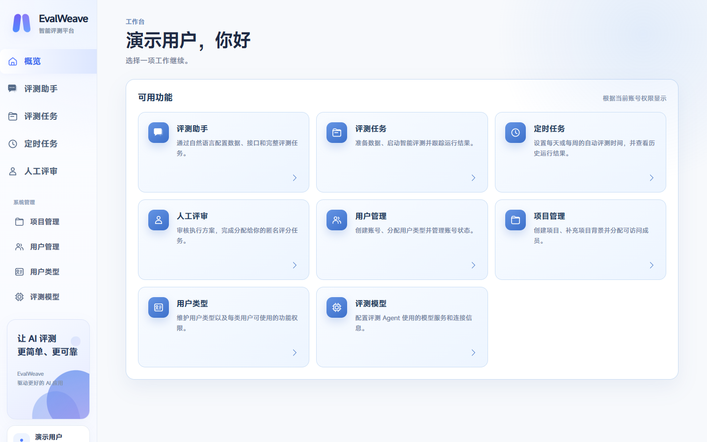
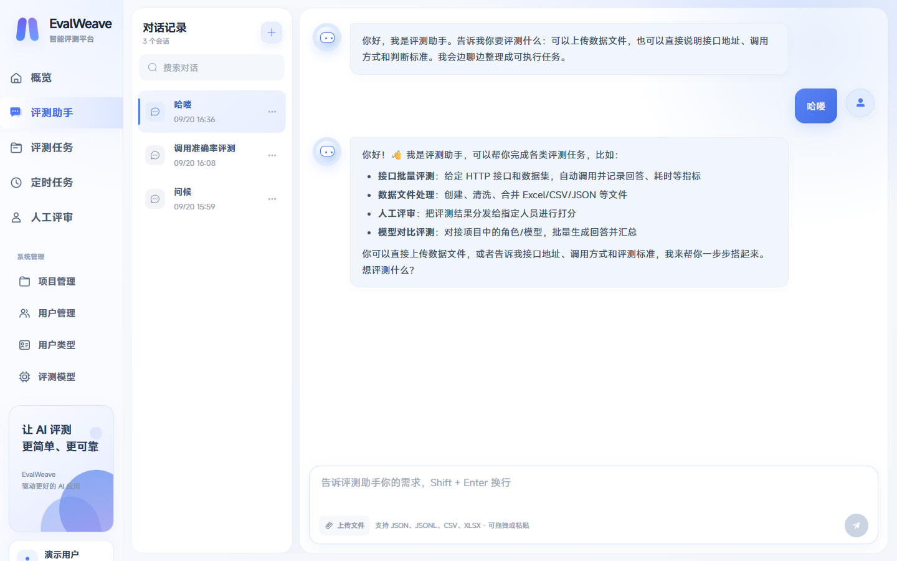
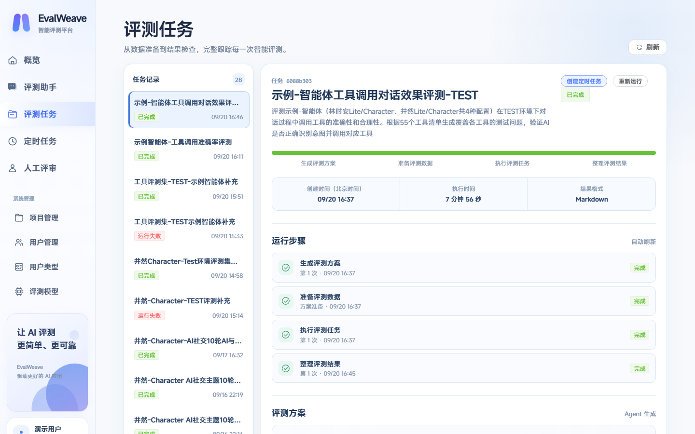
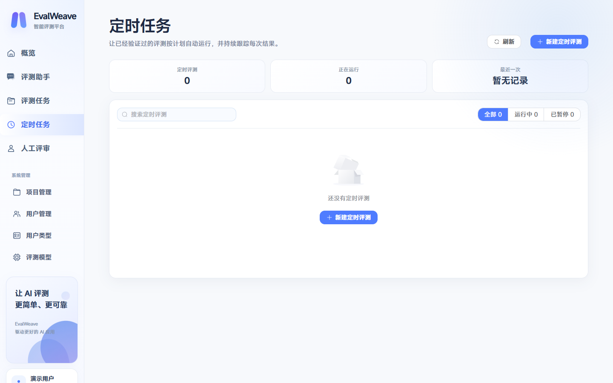
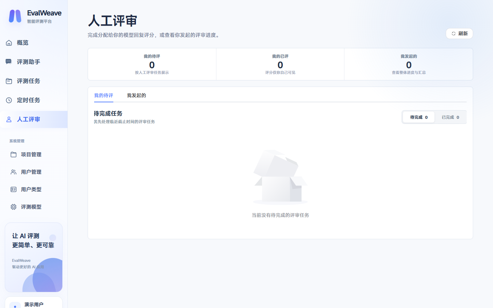
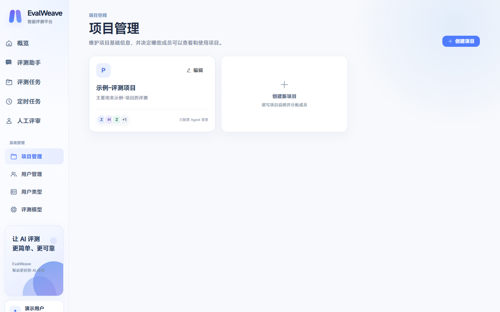
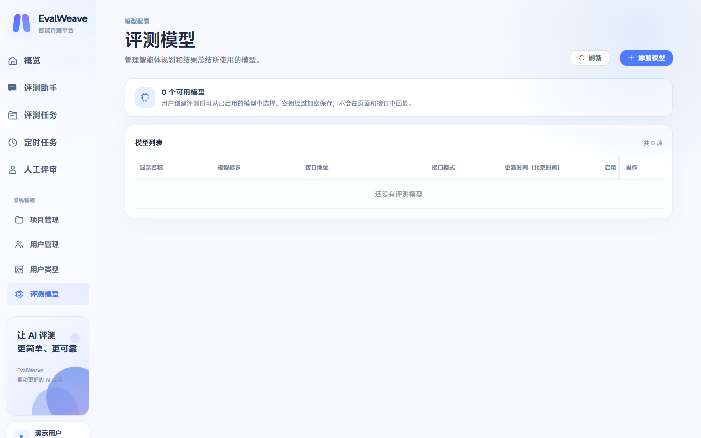
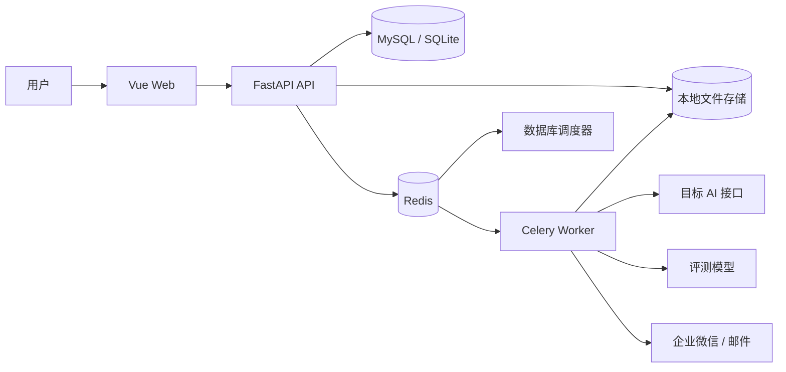

<div align="center">

# EvalWeave

**让 AI 的每一步，都可以被度量。**

面向 AI 应用的开源评测、执行追踪与人工评审平台。


</div>

## 项目简介

EvalWeave 把分散的测试数据、目标接口、模型裁判、Python 数据处理、人工评审和结果交付组织成一条可追踪的评测链路。你可以直接用自然语言描述需求，也可以上传 JSON、JSONL、CSV 或 Excel 数据，由评测助手完成数据检查、接口探测、任务创建、后台执行和结果整理。

它适合智能体、对话机器人、RAG、工具调用链以及普通 HTTP AI 服务的质量验证。

## 核心能力

| 能力 | 说明 |
| --- | --- |
| 对话式评测助手 | 用自然语言配置评测目标、数据、接口、评分标准和结果格式；支持实时流式输出与工具过程展示。 |
| 后台评测任务 | 长时间任务进入 Celery Worker 执行，展示业务级进度、当前操作与耗时；支持失败修复、重新运行和主动停止。 |
| 数据与文件处理 | 支持 JSON、JSONL、CSV、XLSX；Python 工作区可创建、清洗、转换和导出文件，存储目录可配置。 |
| 智能结果判断 | 不只检查 HTTP 状态码，还可结合预期行为、响应正文、工具调用和模型裁判完成语义评分。 |
| 人工评审 | 按人员分配匿名评分任务，配置多维评分标准、截止时间和汇总结果。 |
| 定时评测 | 从已验证的任务创建每日或每周计划，保留每次执行记录。 |
| 项目与权限 | Admin 管理项目、成员、用户类型和评测模型；普通用户仅查看所属项目及自己的评测任务。 |
| 结果交付与通知 | 输出 Excel、JSONL、Markdown 或纯文本；支持企业微信文本、Markdown、文件消息及 SMTP 邮件。 |

## 产品预览

### 工作台

所有能力按账号权限集中展示，项目、用户、评测模型与业务入口保持清晰分层。



### 评测助手

在同一个对话中上传数据、描述接口和评分要求。助手会把耗时操作转入后台任务，对话本身保持可响应。



### 评测任务与执行链路

任务页只展示“生成方案、准备数据、执行评测、整理结果”等业务步骤，同时保留状态、耗时、结果文件与重试入口。



### 定时评测与人工评审

<table>
  <tr>
    <td width="50%"></td>
    <td width="50%"></td>
  </tr>
  <tr>
    <td align="center">每日或每周自动执行</td>
    <td align="center">分配、评分、截止时间与汇总</td>
  </tr>
</table>

### 项目与模型管理

<table>
  <tr>
    <td width="50%"></td>
    <td width="50%"></td>
  </tr>
  <tr>
    <td align="center">项目背景与成员范围</td>
    <td align="center">Responses / Chat Completions 模型配置</td>
  </tr>
</table>

> 截图由本地演示环境生成，用户名、项目名、接口地址、邮箱和密钥样式均已脱敏；图片不包含浏览器收藏夹、地址栏或桌面内容。

## 工作方式



- API 负责身份、权限、项目、文件、会话和任务管理。
- Worker 执行接口调用、Python 文件处理、模型评分、失败修复与结果导出。
- Scheduler 从数据库读取定时计划，无需维护本地 Beat 状态文件。
- Redis 分别用于应用缓存/协调、Celery Broker 和结果后端。
- 文件内容与数据库元数据分离，上传目录和临时工作区均可独立配置。

## 快速开始

### 环境要求

- Python 3.12+
- [uv](https://docs.astral.sh/uv/)
- Node.js 20+、Corepack / pnpm
- Redis 6+
- MySQL 8+（也可在本地开发配置中使用 SQLite）

### 1. 准备配置

```powershell
Copy-Item config/application.example.yaml config/application.yaml
```

至少修改以下内容：

- `database.url`：数据库连接地址
- `redis.url`、`celery.broker_url`、`celery.result_backend`
- `auth.jwt_secret` 与初始管理员密码
- `agent.enabled`、模型地址、模型名和 API Key
- `storage.local_directory` 与 `storage.workspace_directory`

`config/application.yaml` 用于保存本地凭据，已被 Git 忽略。不要把真实密钥提交到仓库。

### 2. 安装依赖

```powershell
uv sync
corepack pnpm --dir web install
```

### 3. 启动后端

确保 MySQL 和 Redis 已运行，然后执行：

```powershell
uv run evalweave --config config/application.yaml
```

这条命令会一起启动 API、Celery Worker 和数据库调度器；按 `Ctrl+C` 会统一停止。

如果需要分别调试，也可以使用：

```powershell
uv run evalweave-api --config config/application.yaml
uv run evalweave-worker --config config/application.yaml
uv run evalweave-scheduler --config config/application.yaml
```

### 4. 启动前端

```powershell
corepack pnpm --dir web dev
```

打开 <http://127.0.0.1:5173>。OpenAPI 文档位于 <http://127.0.0.1:8000/docs>。

## 配置示例

模型配置兼容 OpenAI Responses API 与 Chat Completions API：

```yaml
agent:
  enabled: true
  api_mode: responses # 或 chat_completions
  base_url: https://api.openai.com/v1
  api_key: your-api-key
  model: your-model
  timeout_seconds: 120
  max_repair_attempts: 3

storage:
  type: local
  local_directory: ./data/storage
  workspace_directory: ./data/workspaces
```

目标系统的认证信息应只配置在服务端：

```yaml
agent:
  target_headers:
    Authorization: Bearer your-token
  target_auth_flows:
    api.example.com:
      login_url: https://api.example.com/login
      body:
        username: service-account
        password: service-password
      token_path: data.token
      header_name: Authorization
      header_prefix: "Bearer "
```

完整字段请参考 [`config/application.example.yaml`](config/application.example.yaml)。

## 支持的输入与输出

| 类型 | 格式 |
| --- | --- |
| 数据集 | JSON、JSONL、CSV、XLSX |
| 评测结果 | Excel、JSONL、Markdown、纯文本 |
| 企业微信 | 文本、Markdown、文件 |
| 目标接口 | 普通 JSON HTTP 响应、流式/SSE 响应 |

## 项目结构

```text
evalweave/
├── config/                  # 应用配置模板
├── deploy/                  # 基础设施部署文件
├── scripts/                 # 开发与维护脚本
├── src/evalweave/
│   ├── agents/              # Agent、工具、提示词与执行流程
│   ├── api/                 # FastAPI 路由与统一响应
│   ├── auth/                # 登录、权限与身份模型
│   ├── db/                  # SQLModel 数据模型和会话
│   ├── human_reviews/       # 人工评审聚合逻辑
│   ├── notifications/       # 企业微信与邮件通知
│   ├── services/            # 业务服务层
│   ├── storage/             # 本地文件存储
│   └── workers/             # Celery Worker 与调度器
├── tests/                   # 后端测试
└── web/                     # Vue 3 + TypeScript 前端
```

## 质量检查

```powershell
uv run ruff check .
uv run pytest
corepack pnpm --dir web typecheck
corepack pnpm --dir web build
```

## 安全说明

- 登录状态使用 HttpOnly Cookie；接口按用户权限和项目成员关系校验访问范围。
- 普通用户只能查看自己的评测任务；Admin 可管理项目、成员、用户类型与模型配置。
- 模型 Key 和目标接口凭据仅保存在服务端，不回显给浏览器，也不直接暴露给 Python 脚本。
- Python 文件处理运行在独立工作区；正式部署前仍建议增加系统级沙箱、资源配额和网络策略。
- 上线前务必更换示例管理员密码、JWT Secret 及所有示例凭据，并启用 HTTPS Cookie。

## License

[Apache License 2.0](LICENSE)
